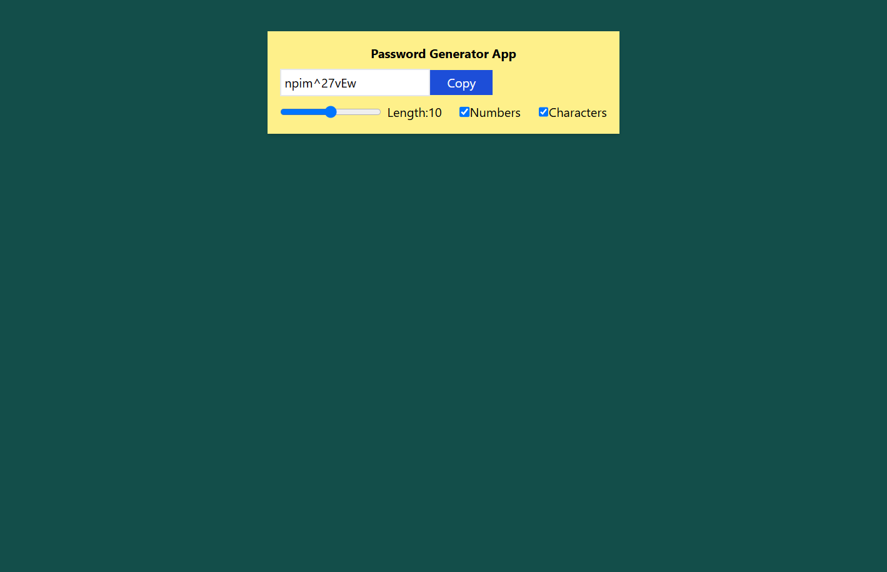

## Password Generator App 
A React app that generates secure passwords based on user-selected criteria (length, numbers, symbols).

**Live Demo:** https://sukhwinder-webdev-code.github.io/React-Password-Generator/  
**GitHub Repo:** [React-Password-Generator](https://github.com/Sukhwinder-webdev-code/React-Password-Generator)

## Table of Contents
- [Overview](#overview)
- [Features](#features)
- [Tech Stack](#tech-stack)
- [Usage](#usage)
- [Screenshots](#screenshots)
- [Deployment](#deployment)
- [Future Improvements](#future-improvements)
- [Author](#author)

## overview
The React Password Generator is a web application built using React.js that enables users to generate secure and customizable passwords instantly. Users can control password length and choose whether to include numbers and special characters, helping create strong passwords for enhanced security.

## features
- Generate secure random passwords
- Customize password length
- Include or exclude numbers
- Include or exclude special characters
- Copy generated password to clipboard
- Responsive and user-friendly interface
- Real-time password generation

## tech-stack
- React.js – Frontend framework
- JavaScript – Application logic
- CSS3 – Styling and responsive design
- Git & GitHub – Version control
- GitHub Pages – Deployment

## usage
1. Open the application in your browser.
2. Select the desired password length.
3. Choose whether to include numbers.
4. Choose whether to include special characters.
5. Generate a secure password instantly.
6. Copy the generated password using the copy button.

## screenshots

## deployment
The project is deployed on github pages.
- Live: https://sukhwinder-webdev-code.github.io/React-Password-Generator/

## future-improvements
- Password strength indicator
- Password history tracking
- Dark and light mode support
- One-click password regeneration
  
## author
Developed by Sukhwinder kaur
- GitHub:  https://github.com/Sukhwinder-webdev-code
- LinkedIn: https://www.linkedin.com/in/sukhwinder-webdev
